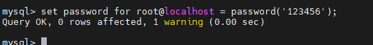

# Linux下安装MySQL5.7

## 一. 卸载CentOS7自带的mariadb

```sh
rpm -qa | grep mysql
whereis mysql
```


```sh
find / -name mysql
```


```sh
rpm -qa|grep mariadb
```


```sh
rpm -e --nodeps mariadb-libs
```


如果/etc/my.cnf存在，删除etc目录下的my.cnf

## 二. 下载MySQL5.7

### 1、上官网下载安装包，这里有好几种方式，也可以使用wget等方式下载，首先进入mysql官网，点击downloads


### 2、进入之后点击框住的地方。


### 3、进入之后点击框体部分


### 4、进入之后点击点击Archives，根据自己配置选择电脑位数，linux选择通用版本，这里楼主选择5.7.36版本，然后点击下载。


## 三. 安装MySQL5.7

### 1. 上传并解压MySQL安装包

```sh
tar -zxvf mysql-5.7.39-linux-glibc2.12-x86_64.tar.gz
```


### 2. 修改文件夹名字为mysql5.7

```sh
mv mysql-5.7.39-linux-glibc2.12-x86_64 mysql5.7
```


### 3. 移动mysql5.7目录到/usr/local下

```shell
mv mysql5.7 /usr/local/
```


### 4.然后创建一个属组，添加mysql用户，紧接着修改属组及属组用户和文件夹权限；输入

```sh
groupadd mysql #创建属组 

useradd -r -g mysql mysql #创建用户
```

切换到/usr/local目录下：

```sh
chown -R mysql:mysql mysql5.7 #修改属组及属组用户 

chmod -R 775 mysql5.7 #修改文件夹权限
```


### 5. 进入到mysql5.7目录下，先创建data目录用于保存数据文件。输入

```sh
mkdir data
```


### 6. 然后再进入**bin**目录下，执行初始化安装命令，务必记住数据库管理员临时密码

```sh
./mysqld --initialize --user=mysql --datadir=/usr/local/mysql5.7/data --basedir=/usr/local/mysql5.7
```


**注意这两个安装路径，**datadir**是设置mysql数据库的数据存放目录，**basedir**是设置mysql的安装目录。

安装完成之后，最下方出现临时密码，记事本记录出现的**临时密码**，因为等会第一次进入需要它来登录mysql。

```sh
2022-10-29T12:50:43.963916Z 1 [Note] A temporary password is generated for root@localhost: alR!ZWwtq4;g
```


### 7. 修改mysql自带的配置文件mysql.server

```shell
vim /usr/local/mysql5.7/support-files/mysql.server
```


修改指定的环境变量路径；进入之后发现这边目录下需要修改，因为刚刚楼主设置的安装目录是**mysql5.7**，如果之前改的名字是**mysql**，那这一步就可以省略了，按默认的就可以了。


### 8. 添加软连接

```shell
ln -s /usr/local/mysql5.7/support-files/mysql.server /etc/init.d/mysql 

ln -s /usr/local/mysql5.7/bin/mysql /usr/local/bin/mysql
```


### 9.创建my.cnf

```shell
vim /etc/my.cnf
```

```mysql
[mysql] 
# 设置mysql客户端默认字符集 
default-character-set=utf8 
[mysqld] 
# 作用是禁止域名解析:在mysql的授权表中就不能使用主机名了，只能使用IP 
skip-name-resolve 
# 设置3306端口 
port = 3306 
#设置远程访问ip bind-address=0.0.0.0 
# 设置mysql的安装目录 
basedir=/usr/local/mysql5.7 
# 设置mysql数据库的数据的存放目录 
datadir=/usr/local/mysql5.7/data 
# 允许最大连接数 max_connections=200 
# 服务端使用的字符集默认为8比特编码的latin1字符集 
character-set-server=utf8 
# 创建新表时将使用的默认存储引擎 
default-storage-engine=INNODB 
#设置查询操作等不区分大小写 
lower_case_table_names=1
```

修改my.cnf文件权限

```shell
chmod -R 775 /etc/my.cnf
```


### 10. 启动mysql

```shell
service mysql start #启动mysql服务 

service mysql stop #停止mysql服务 

service mysql restart #重启mysql服务
```


### 11. 设置开机自启

```sh
chkconfig --add mysql chkconfig --list
```


## 四. 登录MySQL设置密码

### 1. 首次登录mysql，使用到刚才记录的临时密码登录进去，输入

```mysql
mysql -uroot -p
```


### 2. 成功进去之后，输入如下，修改root账户的密码为123456，也可以修改成其他的。

```mysql
set password for root@localhost = password('123456');
```

出现如下Query OK 则证明成功修改。



### 3. 如果防火墙开着的话，建议使用

```sh
firewall-cmd --state
```


开放MySQL端口：

```sh
firewall-cmd --zone=public --add-port=3306/tcp --permanent firewall-cmd --reload
```


**到这里安装就完成啦。**

## 五. 远程连接授权

```mysql
grant all privileges on ***.\*** to 'root'@'%' identified by '123456';
```

或者：

```mysql
grant all privileges on ***.\*** to 'root'@'%' identified by '123456' with grant option;
```

其中**%是指任意ip**，自己自定义一个远程可以访问的账户，账号和密码可以和本地root同名。

```mysql
flush privileges;
```


查看当前mysql的用户

```mysql
select host,user,password_expired,password_last_changed,password_lifetime FROM mysql.user;
```


## 六. 开放云服务器防火墙


## 七. 测试远程连接


 