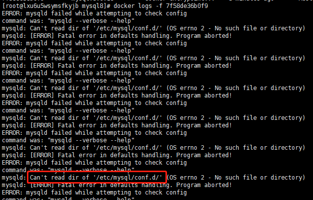
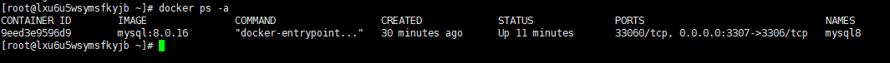
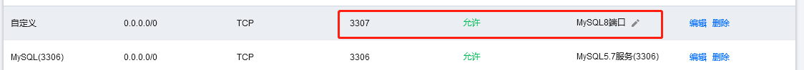

# Docker安装mysql8

## 1. 拉取镜像

```shell
docker pull mysql:8.0.16
```


## 2.创建目录

```shell
mkdir -p /opt/docker_volumn/mysql8/conf

mkdir -p /opt/docker_volumn/mysql8/data
```


## 3.创建my.cnf

```sh
vim /opt/docker_volumn/mysql8/conf/my.cnf
```


```mysql
# Copyright (c) 2017, Oracle and/or its affiliates. All rights reserved.
#
# This program is free software; you can redistribute it and/or modify
# it under the terms of the GNU General Public License as published by
# the Free Software Foundation; version 2 of the License.
#
# This program is distributed in the hope that it will be useful,
# but WITHOUT ANY WARRANTY; without even the implied warranty of
# MERCHANTABILITY or FITNESS FOR A PARTICULAR PURPOSE.  See the
# GNU General Public License for more details.
#
# You should have received a copy of the GNU General Public License
# along with this program; if not, write to the Free Software
# Foundation, Inc., 51 Franklin St, Fifth Floor, Boston, MA  02110-1301 USA
 
#
# The MySQL  Server configuration file.
#
# For explanations see
# http://dev.mysql.com/doc/mysql/en/server-system-variables.html
 
[mysqld]
pid-file        = /var/run/mysqld/mysqld.pid
socket          = /var/run/mysqld/mysqld.sock
datadir         = /var/lib/mysql
secure-file-priv= NULL
# Disabling symbolic-links is recommended to prevent assorted security risks
symbolic-links=0
 
# Custom config should go here
!includedir /etc/mysql/conf.d/

# 默认字符集
character-set-server=utf8
collation-server=utf8_unicode_ci
#设置查询操作等不区分大小写
lower_case_table_names=1
#mysql模式
sql_mode=STRICT_TRANS_TABLES,NO_ZERO_IN_DATE,NO_ZERO_DATE,ERROR_FOR_DIVISION_BY_ZERO,NO_ENGINE_SUBSTITUTION
```

## 4. 运行容器

不能只映射到conf目录，如：-v /opt/docker_volumn/mysql8/conf:/etc/mysql

启动docker后会报错：



一定要映射到具体的配置文件：-v /opt/docker_volumn/mysql8/conf/my.cnf:/etc/mysql/my.cnf

不加日志文件映射：（推荐）

```dockerfile
docker run --name mysql8 -p 3307:3306 \
	-v /opt/docker_volumn/mysql8/my.cnf:/etc/mysql/my.cnf \    
	-v /opt/docker_volumn/mysql8/data:/var/lib/mysql \    
	-e MYSQL_ROOT_PASSWORD='123456' \    
	-d --privileged=true --restart=unless-stopped mysql:8.0.16
```


其中：

```dockerfile
-v /opt/docker_volumn/mysql8/data:/var/lib/mysql \
```

这几个目录会自动创建，但是保险起见，最好还是预先创建


参数说明

```dockerfile
run  run 是运行一个容器 
-d　 表示后台运行 
-p　 表示容器内部端口和服务器端口映射关联 
–privileged=true　设值MySQL 的root用户权限, 否则外部不能使用root用户登陆。 
-e MYSQL_ROOT_PASSWORD='123456'　　　设置MySQL数据库root用户的密码 
–name mysql8　　　　 设值容器名称为mysql8  
mysql:8.0.16　　     表示从docker镜像mysql:8.0.16中启动一个容器
```


## 5. 查看docker是否运行

```dockerfile
docker ps -a
```



如果没有运行，查看docker日志

```dockerfile
docker logs -f 容器ID
```

或者：

```dockerfile
docker logs -f --tail=500 容器ID
```


## 6. 开放端口

```sh
firewall-cmd --state
```

如果Linux防火墙处于运行的状态，需开放端口

```sh
firewall-cmd --zone=public --add-port=3307/tcp --permanent
```


## 7. 开放云服务器防火墙端口



## 8. 进入容器

```dockerfile
docker exec -it mysql8 bash
```


## 9. 登录MySQL

```mysql
mysql -uroot -p
```


## 10. 授权远程登录

下面的授权可以不执行，先去远程连接，如果连不上，再执行

```mysql
GRANT ALL PRIVILEGES ON *.* TO 'root'@'%' WITH GRANT OPTION; 

flush privileges;
```

