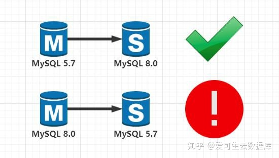
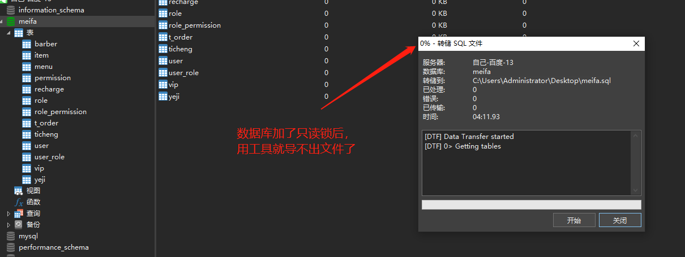
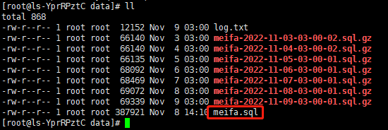
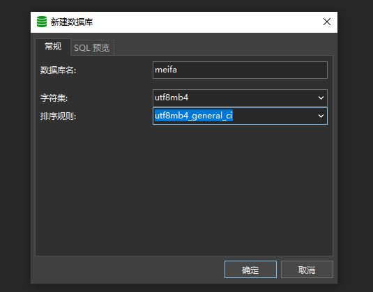
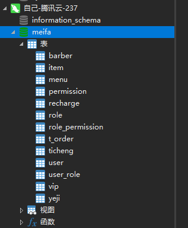
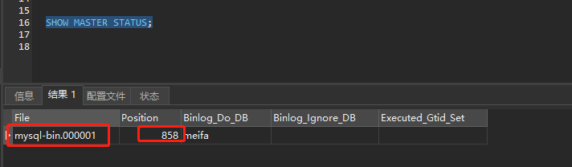
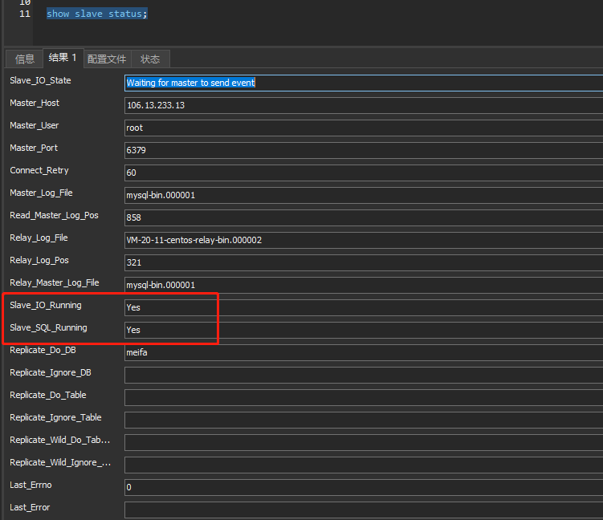

# MySQL主从复制（一主一从）

## 项目场景

1、主服务器106.13.233.13(mysql版本8.0.16)，其中已经有数据库且库中有表

2、从服务器119.91.214.237(mysql版本8.0.16)，空的啥也没有

注意：

**master 5.7 - > slave 8.0** 支持

**master 8.0 - > slave 5.7** 不支持



## 准备工作

主从服务器需要有相同的初态

1、将主服务器要同步的数据库枷锁，避免同步时数据发生改变

```mysql
flush tables with read lock;  
```

注意：如果加了只读锁，千万别用Navicat工具导出sql文件，会造成夯住



2、将主服务器数据库中数据导出

```mysql
mysqldump -uroot -p123456 meifa > /root/mysql-backup/data/meifa.sql;
```



3、备份完成后，解锁主服务器数据库

```mysql
unlock tables;
```

4、在从数据库中创建数据库



5、从库导入主库中的数据库



好了，现在主从服务器拥有一样的初态了

## MySQL主从复制

### 一. Master配置

1、修改my.cnf

```sh
vim /etc/my.cnf
```

```mysql
#主从配置
#主数据库端ID号
server_id = 1           
 #开启二进制日志
log-bin = mysql-bin    
#需要复制的数据库名，如果复制多个数据库，重复设置这个选项即可
binlog-do-db = meifa     
#将从服务器从主服务器收到的更新记入到从服务器自己的二进制日志文件中
log-slave-updates                        
#控制binlog的写入频率。每执行多少次事务写入一次(这个参数性能消耗很大，但可减小MySQL崩溃造成的损失)
sync_binlog = 1                    
#这个参数一般用在主主同步中，用来错开自增值, 防止键值冲突
auto_increment_offset = 1           
#这个参数一般用在主主同步中，用来错开自增值, 防止键值冲突
auto_increment_increment = 1
#二进制日志自动删除的天数，默认值为0,表示“没有自动删除”，启动时和二进制日志循环时可能删除
expire_logs_days = 7
```


2、重启MySQL

```sh
systemctl restart mysqld
```

3、创建slave同步账户，并授权

```mysql
-- 创建slave账号：slave，119.91.214.237为slave的ip，密码123456
-- 注意这里不要创建root用户，以免和root用户权限混淆
CREATE USER 'slave'@'119.91.214.237' IDENTIFIED WITH mysql_native_password BY '123456';
--授权
GRANT REPLICATION SLAVE ON *.* TO 'slave'@'119.91.214.237';
-- 更新数据库权限
flush privileges;
```


4、显示mater状态

```mysql
SHOW MASTER STATUS;
```



### 二. 从库配置

1、修改从库my.cnf配置

```mysql
#主从配置，从库配置
# 从库的id，注意不能重复
server_id = 2
log-bin = mysql-bin
log-slave-updates
sync_binlog = 0
#log buffer将每秒一次地写入log file中，并且log file的flush(刷到磁盘)操作同时进行。该模式下在事务提交的时候，不会主动触发写入磁盘的操作
innodb_flush_log_at_trx_commit = 0        
#指定slave要复制哪个库
replicate-do-db = meifa      
#MySQL主从复制的时候，当Master和Slave之间的网络中断，但是Master和Slave无法察觉的情况下（比如防火墙或者路由问题）。Slave会等待slave_net_timeout设置的秒数后，才能认为网络出现故障，然后才会重连并且追赶这段时间主库的数据
slave-net-timeout = 60  
```


2、重启MySQL

```sh
systemctl start mysql
```

3、执行同步命令

\#执行同步命令，设置主服务器ip，同步账号密码，同步位置 

```mysql
CHANGE MASTER TO 
MASTER_HOST='106.13.233.13', 
MASTER_PORT=6379, 
MASTER_USER='slave', 
MASTER_PASSWORD='123456', 
MASTER_LOG_FILE='mysql-bin.000001', 
MASTER_LOG_POS=858; 
```

#开启同步功能 

```mysql
start slave;
```

4、查看从服务器状态

```mysql
show slave status;
```



Slave_IO_Running及Slave_SQL_Running进程必须正常运行，即Yes状态，否则说明同步失败

若失败查看mysql错误日志中具体报错详情来进行问题定位

最后可以去主服务器上的数据库中创建表或者更新表数据来测试同步