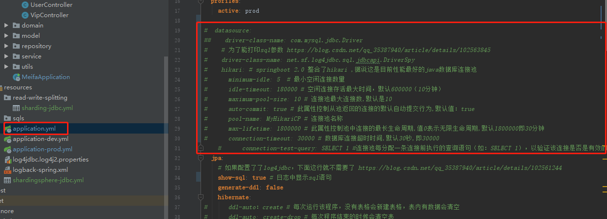
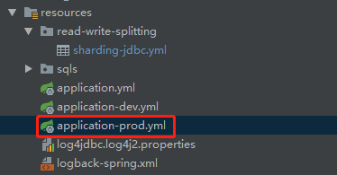
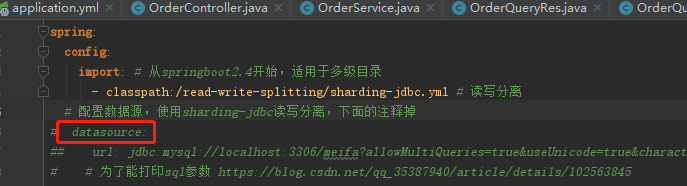
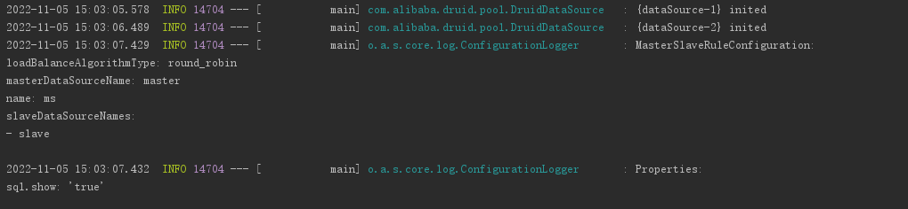
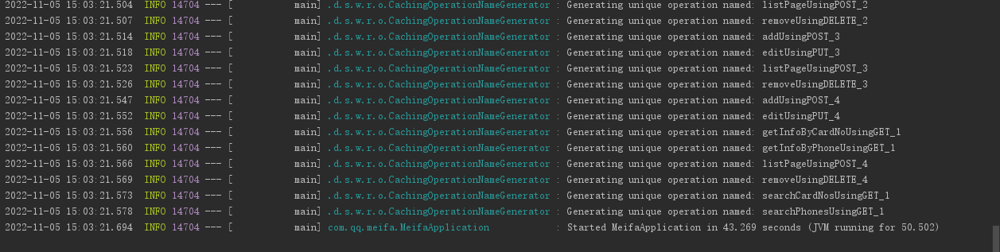

# Sharding-JDBC实现读写分离

## 1. 导入sharding-jdbc依赖

```java
<!--sharding-jdbc-->
<dependency>
   <groupId>org.apache.shardingsphere</groupId>
   <artifactId>sharding-jdbc-spring-boot-starter</artifactId>
   <version>4.1.1</version>
</dependency>
```

## 2. 注释掉application.yml中的数据源连接池配置



## 3. 注释掉application-prod.yml中的数据源





## 4. 添加sharding-jdbc读写分离配置

```java
spring:
  shardingsphere:
    # 数据源相关配置
    datasource:
      # 数据源名称
      names: master,slave
      # MySQL master数据源
      master:
        # 数据库连接池
        type: com.alibaba.druid.pool.DruidDataSource
        driver-class-name: com.mysql.jdbc.Driver
        url: jdbc:mysql://106.13.233.13:6379/meifa?allowMultiQueries=true&useUnicode=true&characterEncoding=UTF8&zeroDateTimeBehavior=convertToNull&useSSL=false&allowPublicKeyRetrieval=true&serverTimezone=GMT%2B8
        username: root
        password: '数据库密码'
      # 两个slave数据源
      slave:
        type: com.alibaba.druid.pool.DruidDataSource
        driver-class-name: com.mysql.jdbc.Driver
        # 多个从库的故障转移，加loadbalance
        # url: jdbc:mysql:loadbalance://slave1:port,slave2:port/meifa?allowMultiQueries=true&useUnicode=true&characterEncoding=UTF8&zeroDateTimeBehavior=convertToNull&useSSL=false&allowPublicKeyRetrieval=true&serverTimezone=GMT%2B8
        url: jdbc:mysql://119.91.214.237:3307/meifa?allowMultiQueries=true&useUnicode=true&characterEncoding=UTF8&zeroDateTimeBehavior=convertToNull&useSSL=false&allowPublicKeyRetrieval=true&serverTimezone=GMT%2B8
        username: root
        password: '数据库密码'
    masterslave:
      load-balance-algorithm-type: round_robin
      name: ms
      master-data-source-name: master
      slave-data-source-names: slave

    # 其他属性
    props:
      # 开启SQL显示
      sql.show: true
```

## 5. 启动类中排除Druid数据源自动装配

```java
@SpringBootApplication
        /**
         * 使用sharding-jdbc后，需要把下面的DruidDataSourceAutoConfigure数据源配置排除掉，否则启动报错：
         * Field userRepository in com.qq.meifa.common.config.security.CustomUserDetailsService required a bean named 'entityManagerFactory' that could not be found.
         *
         * The injection point has the following annotations:
         *     - @org.springframework.beans.factory.annotation.Autowired(required=true)
         *
         *
         * Action:
         *
         * Consider defining a bean named 'entityManagerFactory' in your configuration.
         */
//        (exclude = {DataSourceAutoConfiguration.class, DruidDataSourceAutoConfigure.class})
        (exclude = {DruidDataSourceAutoConfigure.class})  // DataSourceAutoConfiguration可以不用排除，也能启动成功
```

## 6. 启动springboot

如果配置成功，控制台会打印主从配置，如下图：



